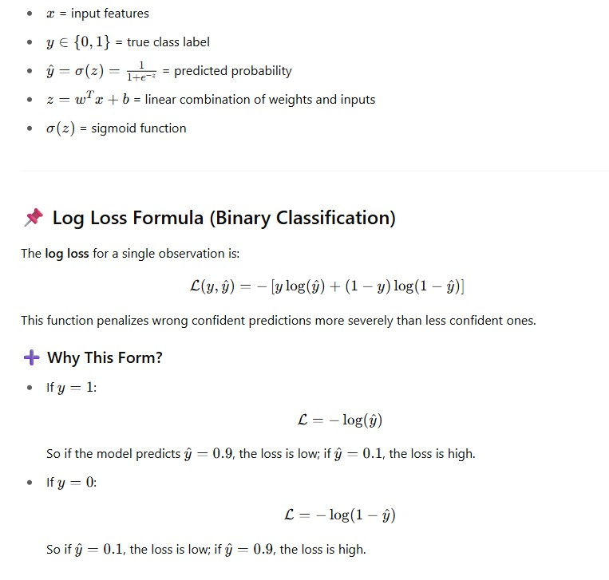

Here's a detailed `README.md` file in Markdown format that covers the **Classification Algorithms** you've listed, with structured sections for **Introduction**, **Mathematical Details**, and **How it Works** for each:

---

# 🧠 Classification Algorithms – A Comprehensive Guide

This guide provides an in-depth look into various classification algorithms commonly used in Machine Learning. The focus is on understanding the **intuition**, **math**, and **working** behind each algorithm.

---

## 📘 Table of Contents

1. [Logistic Regression](#logistic-regression)
2. [Bagging Algorithms](#bagging-algorithms)

   - [Decision Tree Classifier](#decision-tree-classifier)
   - [Random Forest Classifier](#random-forest-classifier)

3. [Boosting Algorithms](#boosting-algorithms)

   - [Gradient Boosting Machine (GBM)](#gradient-boosting-machine-gbm)
   - [XGBoost](#xgboost)
   - [CatBoost](#catboost-algorithm)
   - [LightGBM](#lightgbm-classifier)

---

## Logistic Regression

### 1.1 Introduction

Logistic Regression is a **linear classification algorithm** used to predict the **probability** of a binary outcome (0 or 1). Despite the name, it is a classification algorithm, not a regression one.

### 1.2 Mathematical Details

- **Hypothesis Function**:
  $h_\theta(x) = \frac{1}{1 + e^{-\theta^T x}}$
  where $\theta$ are the weights, and $x$ is the input feature vector.

- **Cost Function** (Log Loss):

- **Optimization**: Typically solved using **Gradient Descent**.

### 1.3 How It Works

1. The model computes a weighted sum of input features.
2. Applies the **sigmoid function** to convert this sum into a probability.
3. Classifies as **1 if probability > 0.5**, else **0**.
4. Trained by minimizing log-loss using optimization techniques.

---

## Bagging Algorithms

### Decision Tree Classifier

#### 1.1 Introduction

A Decision Tree is a flowchart-like structure used for both classification and regression. It splits data based on feature values.

#### 1.2 Mathematical Details

- **Splitting Criteria**:

  - **Gini Impurity**:

    $$
    Gini = 1 - \sum_{i=1}^{k} p_i^2
    $$

  - **Entropy (Information Gain)**:

    $$
    Entropy = -\sum_{i=1}^{k} p_i \log_2(p_i)
    $$

#### 1.3 How It Works

1. At each node, the best feature to split is selected based on Gini/Entropy.
2. This process continues recursively until stopping criteria are met (e.g., max depth).
3. Predictions are made by traversing the tree to a leaf node.

---

### Random Forest Classifier

#### 1.1 Introduction

Random Forest is an **ensemble method** that builds multiple decision trees and combines their outputs to improve generalization.

#### 1.2 Mathematical Details

- Uses **Bootstrap Aggregation (Bagging)**:

  - Creates **multiple bootstrapped samples**.
  - Builds a **decision tree** on each.

- At each split, only a **random subset of features** is considered.

#### 1.3 How It Works

1. Train multiple decision trees on random subsets of the data.
2. For classification, use **majority voting** of all trees.
3. Reduces **variance** and avoids overfitting compared to single trees.

---

## Boosting Algorithms

### Gradient Boosting Machine (GBM)

#### 1.1 Introduction

GBM is an ensemble technique that builds trees sequentially, where each tree **corrects the error** of the previous one.

#### 1.2 Mathematical Details

- **Loss Function** (e.g., Log Loss for classification).

- Model is built as:

  $$
  F_{m}(x) = F_{m-1}(x) + \gamma_m h_m(x)
  $$

  where $h_m(x)$ is a weak learner (usually a shallow tree).

- **Gradient Descent in Function Space**:
  At each step, it fits a model to the **negative gradient** of the loss.

#### 1.3 How It Works

1. Start with an initial prediction (e.g., log-odds).
2. Calculate residuals (gradients of loss).
3. Train a weak learner to predict residuals.
4. Update the prediction using a learning rate.

---

### XGBoost

#### 1.1 Introduction

XGBoost stands for **Extreme Gradient Boosting**, an optimized and regularized implementation of GBM. Known for its speed and performance.

#### 1.2 Mathematical Details

- **Objective Function**:

  $$
  Obj = \sum_{i=1}^{n} l(y_i, \hat{y}_i) + \sum_{k=1}^{K} \Omega(f_k)
  $$

  where $\Omega(f_k) = \gamma T + \frac{1}{2} \lambda \sum w_i^2$

- Uses **second-order Taylor approximation** for optimization.

#### 1.3 How It Works

1. Similar to GBM, but includes **regularization** to control overfitting.
2. Uses **pruning** and **column block caching** for speed.
3. Supports **parallel training** of trees.

---

### CatBoost Algorithm

Certainly! Here's an enhanced section for **CatBoost** in your `README.md`, incorporating detailed explanations of its unique features, akin to the descriptions provided for LightGBM's GOSS and EFB.

---

### CatBoost Algorithm

#### 1.1 Introduction

CatBoost is an open-source gradient boosting library developed by Yandex, designed to handle categorical features efficiently without extensive preprocessing. It excels in scenarios with a mix of numerical and categorical data, offering robust performance with minimal parameter tuning.([GeeksforGeeks][1])

#### 1.2 Mathematical Details

- **Ordered Boosting**: CatBoost introduces _ordered boosting_ to mitigate overfitting caused by target leakage. Instead of using the entire dataset to compute statistics for categorical features, it processes data in a sequential manner, ensuring that the prediction for a data point is not influenced by its own target value. ([wiki.math.uwaterloo.ca][2])

- **Symmetric Trees (Oblivious Trees)**: Unlike traditional decision trees that can grow asymmetrically, CatBoost constructs symmetric trees where all leaves at the same depth are split using the same feature and threshold. This structure leads to faster computation and better generalization. ([neptune.ai][3])

- **Efficient Handling of Categorical Features**: CatBoost natively processes categorical variables using techniques like _ordered target statistics_, eliminating the need for one-hot encoding or label encoding. This approach reduces overfitting and improves model accuracy. ([blog.dataiku.com][4])

#### 1.3 How It Works

1. **Data Preprocessing**: CatBoost automatically identifies categorical features and applies _ordered target statistics_ to convert them into numerical representations, preserving the inherent order and reducing overfitting.

2. **Model Training**:

   - Utilizes _ordered boosting_ to prevent target leakage by ensuring that each data point's prediction is based only on prior data points.
   - Builds _symmetric trees_, which enhance computational efficiency and model robustness.([wiki.math.uwaterloo.ca][2], [neptune.ai][3])

3. **Prediction**: During inference, CatBoost applies the trained symmetric trees to new data, efficiently handling both numerical and categorical features without additional preprocessing.

---

By incorporating these advanced techniques, CatBoost offers a powerful solution for classification tasks, especially when dealing with datasets containing categorical variables.

---

[1]: https://www.geeksforgeeks.org/handling-categorical-features-with-catboost/?utm_source=chatgpt.com "Handling categorical features with CatBoost | GeeksforGeeks"
[2]: https://wiki.math.uwaterloo.ca/statwiki/index.php?title=CatBoost%3A_unbiased_boosting_with_categorical_features&utm_source=chatgpt.com "CatBoost: unbiased boosting with categorical features - statwiki"
[3]: https://neptune.ai/blog/when-to-choose-catboost-over-xgboost-or-lightgbm?utm_source=chatgpt.com "When to Choose CatBoost Over XGBoost or LightGBM - Neptune.ai"
[4]: https://blog.dataiku.com/how-do-gradient-boosting-algorithms-handle-categorical-variables?utm_source=chatgpt.com "How Do Gradient Boosting Algorithms Handle Categorical Variables?"

---

### LightGBM Classifier

Certainly! Here's an enhanced section for **LightGBM** in your `README.md`, incorporating detailed explanations of its unique features, namely **Gradient-based One-Side Sampling (GOSS)** and **Exclusive Feature Bundling (EFB)**.

---

### LightGBM Classifier

#### 1.1 Introduction

LightGBM (Light Gradient Boosting Machine) is a high-performance, open-source gradient boosting framework developed by Microsoft. It is designed for speed and efficiency, particularly on large datasets and high-dimensional data. LightGBM introduces two novel techniques: **Gradient-based One-Side Sampling (GOSS)** and **Exclusive Feature Bundling (EFB)**, which significantly enhance its performance compared to traditional gradient boosting methods.([Wikipedia][1], [Medium][2])

#### 1.2 Mathematical Details

- **Gradient-based One-Side Sampling (GOSS)**: In traditional gradient boosting, each iteration involves computing gradients for all data instances, which can be computationally intensive. GOSS addresses this by:

  - Retaining all instances with large gradients (i.e., instances the model currently predicts poorly), as they are more informative for learning.
  - Randomly sampling a subset of instances with small gradients (i.e., instances the model predicts well), reducing the data size while maintaining accuracy.
  - To correct the bias introduced by this sampling, GOSS adjusts the data distribution by applying a constant multiplier to the sampled instances with small gradients.([MachineLearningMastery.com][3])

  This approach allows LightGBM to focus on the most informative instances, accelerating training without significant loss in accuracy.

- **Exclusive Feature Bundling (EFB)**: High-dimensional data, especially with many sparse features (e.g., one-hot encoded categorical variables), can slow down training. EFB tackles this by:

  - Identifying mutually exclusive features—features that rarely take non-zero values simultaneously.
  - Bundling these features into a single feature, reducing the number of features and thus the computational cost.
  - Ensuring that the original feature values can be accurately recovered from the bundled feature, maintaining model interpretability.([ApX Machine Learning][4], [Medium][5], [Wikipedia][1], [Data Science Stack Exchange][6])

  By reducing the number of features, EFB decreases the complexity of histogram construction from $O(\text{data} \times \text{features})$ to $O(\text{data} \times \text{bundles})$, enhancing training efficiency.([Medium][5])

#### 1.3 How It Works

1. **Data Preprocessing**:

   - LightGBM automatically identifies and bundles mutually exclusive features using EFB, reducing feature dimensionality.([neptune.ai][7])

2. **Model Training**:

   - During each iteration, LightGBM computes gradients for all data instances.
   - Applies GOSS to select a subset of data: retains all instances with large gradients and samples from those with small gradients.
   - Builds decision trees using a leaf-wise growth strategy, choosing the leaf with the maximum delta loss to grow, which can lead to deeper trees and potentially better accuracy.([NeurIPS Proceedings][8], [MachineLearningMastery.com][3], [GeeksforGeeks][9])

3. **Prediction**:

   - For new data, LightGBM uses the trained model to make predictions efficiently, benefiting from the reduced feature set and optimized tree structures.

---

By integrating GOSS and EFB, LightGBM achieves faster training speeds and lower memory usage while maintaining high accuracy, making it a powerful tool for large-scale machine learning tasks.

---

[1]: https://en.wikipedia.org/wiki/LightGBM?utm_source=chatgpt.com "LightGBM"
[2]: https://medium.com/%40turkishtechnology/light-gbm-light-and-powerful-gradient-boost-algorithm-eaa1e804eca8?utm_source=chatgpt.com "Light GBM Light and Powerful Gradient Boost Algorithm - Medium"
[3]: https://machinelearningmastery.com/exploring-lightgbm-leaf-wise-growth-with-gbdt-and-goss/?utm_source=chatgpt.com "Exploring LightGBM: Leaf-Wise Growth with GBDT and GOSS"
[4]: https://apxml.com/courses/mastering-gradient-boosting-algorithms/chapter-5-lightgbm-light-gradient-boosting/lightgbm-efb?utm_source=chatgpt.com "LightGBM Exclusive Feature Bundling (EFB) - ApX Machine Learning"
[5]: https://medium.com/%40origoldbsc/understanding-lightgbm-a-friendly-guide-9fe08db5effa?utm_source=chatgpt.com "Understanding LightGBM: A Friendly Guide | by Ori Golfryd - Medium"
[6]: https://datascience.stackexchange.com/questions/41907/lightgbm-why-exclusive-feature-bundling-efb?utm_source=chatgpt.com "LightGBM - Why Exclusive Feature Bundling (EFB)?"
[7]: https://neptune.ai/blog/xgboost-vs-lightgbm?utm_source=chatgpt.com "XGBoost vs LightGBM: How Are They Different - Neptune.ai"
[8]: https://proceedings.neurips.cc/paper/6907-lightgbm-a-highly-efficient-gradient-boosting-decision-tree.pdf?utm_source=chatgpt.com "[PDF] LightGBM: A Highly Efficient Gradient Boosting Decision Tree"
[9]: https://www.geeksforgeeks.org/lightgbm-feature-parameters/?utm_source=chatgpt.com "LightGBM Feature parameters | GeeksforGeeks"

---

## ✅ Conclusion

Each classification algorithm has its strengths and trade-offs:

| Algorithm           | Strengths                    | When to Use                                 |
| ------------------- | ---------------------------- | ------------------------------------------- |
| Logistic Regression | Simple, interpretable        | Baseline model, linear relationships        |
| Decision Tree       | Intuitive, easy to visualize | Small datasets, low interpretability needed |
| Random Forest       | Robust, less overfitting     | General-purpose classification              |
| GBM                 | High accuracy                | Structured/tabular data                     |
| XGBoost             | Fast, regularized GBM        | Competitions, large feature sets            |
| CatBoost            | Categorical feature handling | Mixed-type datasets                         |
| LightGBM            | Scalable, fast               | Large-scale datasets                        |

---
