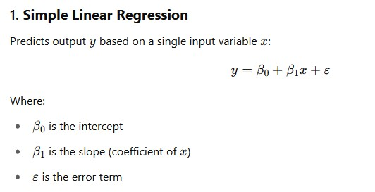

# 📘 Regression Algorithms

This document contains an overview of various regression algorithms commonly used in machine learning, including when to use them, their assumptions, pros and cons, mathematical formulation (where applicable), and example imports.

---

## 📚 Table of Contents

1. [Linear Regression](#linear-regression)
2. [Ridge Regression](#ridge-regression)
3. [Lasso Regression](#lasso-regression)
4. [Elastic Net Regression](#elastic-net-regression)
5. [Polynomial Regression](#polynomial-regression)
6. [Support Vector Regression (SVR)](#support-vector-regression-svr)
7. [Decision Tree Regression](#decision-tree-regression)
8. [Random Forest Regression](#random-forest-regression)
9. [Gradient Boosting Regression](#gradient-boosting-regression)

---

## Linear Regression

Linear Regression is one of the most fundamental and widely used algorithms in statistics and machine learning. It models the relationship between a dependent variable and one or more independent variables by fitting a linear equation to observed data.

---

## 📌 When is Linear Regression Used?

Linear Regression is primarily used when the goal is to **predict a continuous numeric outcome** based on one or more predictor variables. It is effective when:

- There is a **linear relationship** between the input(s) and the output.
- You want a **simple, interpretable model**.
- Estimating the **impact of one variable on another** is important.

### 📈 Real-World Use Cases:

- Predicting **house prices** based on features like area, location, and number of rooms.
- Estimating **sales revenue** from advertising budgets.
- Modeling **growth trends** over time.
- Assessing **risk scores** in credit scoring or insurance.

---

## 🧠 Assumptions of Linear Regression

To produce reliable results, linear regression makes several key assumptions:

1. **Linearity**
   The relationship between the independent and dependent variable(s) is linear.

2. **Independence of Errors**
   Observations are independent of each other. Residuals (errors) are not correlated.

3. **Homoscedasticity**
   The variance of error terms is constant across all levels of the independent variables.

4. **Normality of Errors**
   The residuals (differences between observed and predicted values) are normally distributed.

5. **No Multicollinearity** _(for multiple linear regression)_
   Independent variables should not be too highly correlated with each other.

6. **No Autocorrelation**
   Particularly important for time-series data: residuals should not show patterns over time.

---

## ✅ Pros of Linear Regression

- 🔍 **Simple and Interpretable**: Easy to implement and understand.
- 🚀 **Fast Training**: Computationally efficient even on large datasets.
- 📊 **Statistical Foundation**: Offers insight into variable relationships via coefficients and p-values.
- 🔎 **Feature Importance**: Coefficients directly indicate influence of predictors.
- 🛠️ **Baseline Model**: Often serves as a benchmark for more complex models.

---

## ❌ Cons of Linear Regression

- 📉 **Poor Performance on Non-Linear Data**: Cannot model complex patterns without transformation.
- 🎯 **Sensitive to Outliers**: Outliers can heavily skew results.
- 🔄 **Requires Feature Engineering**: Needs manual work to handle categorical features or interactions.
- 🔬 **Assumption-Dependent**: Violations of assumptions (e.g., multicollinearity or heteroscedasticity) degrade model quality.
- ⚖️ **Overfitting with High-Dimensional Data**: Especially in multiple regression without regularization.

---

## 🧮 Mathematical Formulation

### 2. **Multiple Linear Regression**

For multiple input features $x_1, x_2, ..., x_n$:

$$
y = \beta_0 + \beta_1 x_1 + \beta_2 x_2 + \cdots + \beta_n x_n + \varepsilon
$$

In matrix form:

$$
\mathbf{y} = \mathbf{X} \boldsymbol{\beta} + \boldsymbol{\varepsilon}
$$

Where:

- $\mathbf{y} \in \mathbb{R}^{m}$ is the output vector
- $\mathbf{X} \in \mathbb{R}^{m \times n}$ is the matrix of input features
- $\boldsymbol{\beta} \in \mathbb{R}^{n}$ is the coefficient vector
- $\boldsymbol{\varepsilon} \in \mathbb{R}^{m}$ is the error vector

### 3. **Cost Function (Loss Function)**

Linear regression minimizes the **Mean Squared Error (MSE)**:

$$
J(\boldsymbol{\beta}) = \frac{1}{m} \sum_{i=1}^{m} \left( y_i - \hat{y}_i \right)^2 = \frac{1}{m} \sum_{i=1}^{m} \left( y_i - (\mathbf{x}_i^T \boldsymbol{\beta}) \right)^2
$$

### 4. **Normal Equation Solution**

For optimal coefficients:

$$
\boldsymbol{\hat{\beta}} = (\mathbf{X}^T \mathbf{X})^{-1} \mathbf{X}^T \mathbf{y}
$$

---

## 📌 Ridge Regression

> `from sklearn.linear_model import Ridge`

Ridge Regression is a type of linear regression that includes **L2 regularization** to prevent overfitting and handle multicollinearity.

### 🧠 When to Use:

- When predictors are highly correlated.
- To prevent overfitting in high-dimensional data.

### ✅ Pros:

- Reduces model variance and overfitting.
- Keeps all features (no coefficient becomes zero).
- Handles multicollinearity well.

### ❌ Cons:

- Less interpretable due to coefficient shrinkage.
- Doesn't perform feature selection.

### 🧮 Mathematical Formulation:

$$
J(\boldsymbol{\beta}) = \frac{1}{m} \sum_{i=1}^{m} (y_i - \hat{y}_i)^2 + \lambda \sum_{j=1}^{n} \beta_j^2
$$

Where $\lambda$ is the regularization parameter.

---

## 📌 Lasso Regression

> `from sklearn.linear_model import Lasso`

Lasso Regression is a linear model that uses **L1 regularization**, which can shrink some coefficients entirely to zero, effectively performing feature selection.

### 🧠 When to Use:

- When feature selection is desired.
- When dataset has many irrelevant or correlated variables.

### ✅ Pros:

- Can eliminate irrelevant features.
- Reduces complexity of the model.

### ❌ Cons:

- Can behave erratically when predictors are highly correlated.
- May underperform when all variables are important.

### 🧮 Mathematical Formulation:

$$
J(\boldsymbol{\beta}) = \frac{1}{m} \sum_{i=1}^{m} (y_i - \hat{y}_i)^2 + \lambda \sum_{j=1}^{n} |\beta_j|
$$

---

## 📌 Elastic Net Regression

> `from sklearn.linear_model import ElasticNet`

Elastic Net combines both **L1 (Lasso)** and **L2 (Ridge)** regularizations, aiming to enjoy benefits from both.

### 🧠 When to Use:

- When there are multiple correlated features.
- When you want feature selection and coefficient shrinkage.

### ✅ Pros:

- Works well when predictors are highly correlated.
- Balances Ridge and Lasso benefits.

### ❌ Cons:

- More complex due to two hyperparameters: $\alpha$ and $l1\_ratio$.

### 🧮 Mathematical Formulation:

$$
J(\boldsymbol{\beta}) = \frac{1}{m} \sum_{i=1}^{m} (y_i - \hat{y}_i)^2 + \lambda_1 \sum |\beta_j| + \lambda_2 \sum \beta_j^2
$$

---

## 📌 Polynomial Regression

> `from sklearn.preprocessing import PolynomialFeatures` > `from sklearn.linear_model import LinearRegression`

Polynomial Regression is an extension of linear regression where the relationship between the variables is modeled as an $n$-th degree polynomial.

### 🧠 When to Use:

- When data shows **non-linear** patterns but you want to stay within the linear modeling framework.

### ✅ Pros:

- Can fit non-linear patterns.
- Easy to implement and interpret (for low-degree polynomials).

### ❌ Cons:

- High-degree polynomials can lead to overfitting.
- Sensitive to outliers.

### 🧮 Mathematical Formulation:

$$
y = \beta_0 + \beta_1 x + \beta_2 x^2 + \cdots + \beta_n x^n + \varepsilon
$$

Use `PolynomialFeatures(degree=n)` to transform the input features.

---

## 📌 Support Vector Regression (SVR)

> `from sklearn.svm import SVR`

Support Vector Regression uses the principles of Support Vector Machines for regression, fitting the best line within a margin of tolerance.

### 🧠 When to Use:

- When you need robust performance with **non-linear data**.
- Effective for **small to medium datasets** with complex relationships.

### ✅ Pros:

- Works well in high-dimensional space.
- Flexible kernel functions (linear, RBF, etc.).
- Robust to outliers.

### ❌ Cons:

- Slow on large datasets.
- Requires careful tuning of hyperparameters.

### 🧮 Objective:

Minimize:

$$
\frac{1}{2} \|w\|^2 + C \sum_{i=1}^n (\xi_i + \xi_i^*)
$$

Subject to:

$$
y_i - w^T x_i - b \leq \varepsilon + \xi_i \\
w^T x_i + b - y_i \leq \varepsilon + \xi_i^*
$$

---

## 📌 Decision Tree Regression

> `from sklearn.tree import DecisionTreeRegressor`

Decision Tree Regression splits the data into hierarchical intervals and fits simple prediction models in each.

### 🧠 When to Use:

- When data has **non-linear and complex relationships**.
- When **interpretability** and **visualization** are desired.

### ✅ Pros:

- Easy to interpret.
- Handles non-linear data without transformation.
- No need for feature scaling.

### ❌ Cons:

- Prone to overfitting.
- Sensitive to small data changes.

---

## 📌 Random Forest Regression

> `from sklearn.ensemble import RandomForestRegressor`

Random Forest Regression is an **ensemble method** that builds multiple decision trees and averages their results.

### 🧠 When to Use:

- When you want better generalization and accuracy over a single tree.
- Suitable for both linear and non-linear data patterns.

### ✅ Pros:

- Reduces overfitting.
- Handles missing values well.
- Works well with both numerical and categorical data.

### ❌ Cons:

- Less interpretable than individual trees.
- Slower and more memory-intensive.

---

## 📌 Gradient Boosting Regression

> `from sklearn.ensemble import GradientBoostingRegressor`

Gradient Boosting builds trees sequentially, where each new tree attempts to correct errors from the previous ones.

### 🧠 When to Use:

- When **accuracy is a priority** and you can afford computational cost.
- Excellent for **tabular data** with non-linear relationships.

### ✅ Pros:

- High predictive accuracy.
- Handles mixed data types and missing values.

### ❌ Cons:

- Computationally expensive.
- Prone to overfitting if not tuned properly.

### 🧮 Conceptual Objective:

Minimizes a loss function $L(y, \hat{y})$ by adding weak learners (e.g., shallow trees) using:

$$
\hat{y}^{(t)} = \hat{y}^{(t-1)} + \eta \cdot h_t(x)
$$

Where:

- $h_t(x)$ is the t-th weak learner
- $\eta$ is the learning rate

---
